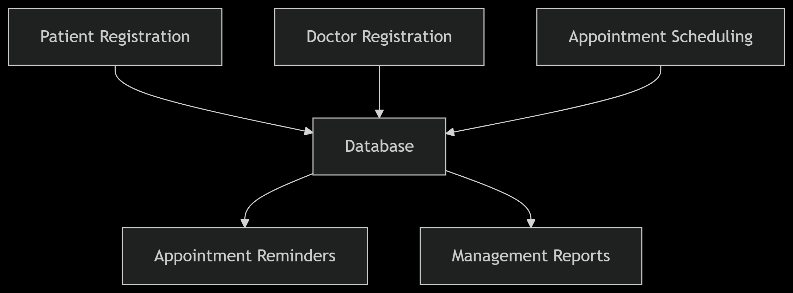
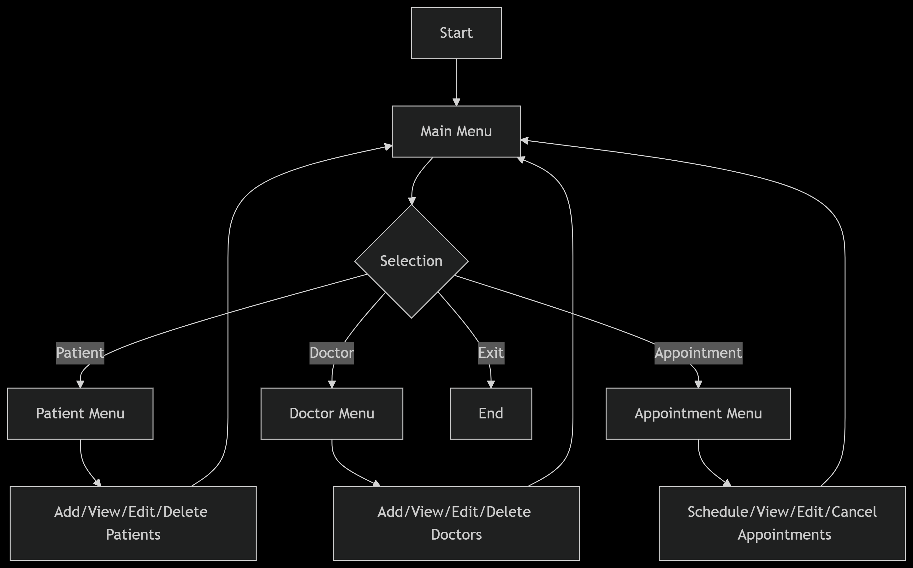
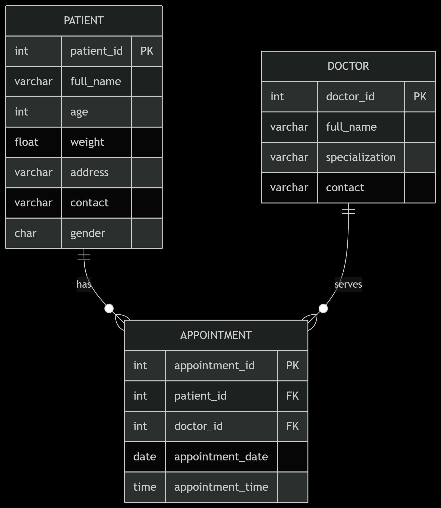

# Hospital Appointment System

### System Overview
The Hospital Appointment System is a console-based application that manages patient records, doctor information, and appointment scheduling using SQLite for data storage. Key features include:

* Patient management (add/view/update)
* Doctor management (add/view)
* Appointment scheduling (create/view/cancel)
* Search and filtering capabilities
* Data validation and integrity enforcement

### System Architecture

### Data Flow Diagram

### Work Flow Diagram

### Database ER Diagram

